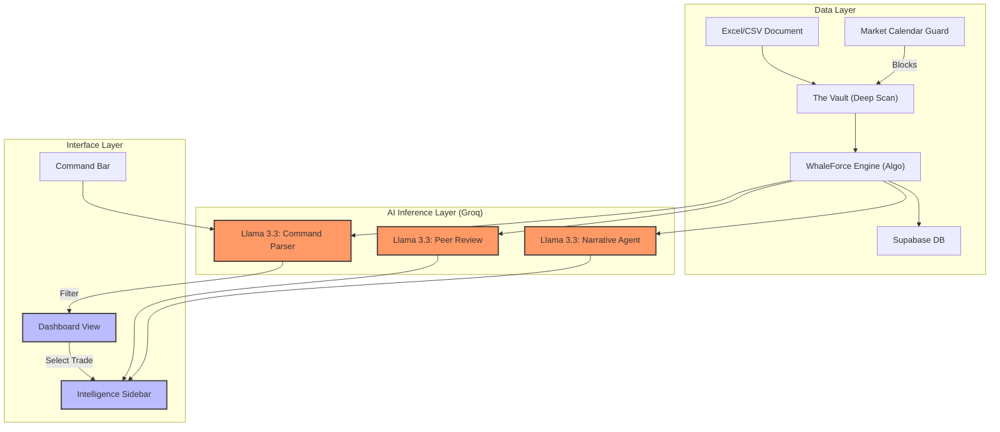

# TRADE_TERMINAL // WHALE_FLOW v4.0


## 🌐 [EXPLORE THE LIVE TERMINAL](https://v0-tradeterminal.vercel.app/)

> **"Signal is brilliance. Noise is darkness. Trade with the Whales."**

## // EXECUTIVE SUMMARY
**TradeTerminal** is an AI-native financial intelligence workstation built to decode institutional trade flow. By leveraging specialized AI agents and high-speed inference, it transforms thousands of raw trade signals into a clean, actionable narrative with a focus on **Institutional Ingestion** and **Data Integrity**.

The system now features a robust, calendar-locked ingestion pipeline designed to mirror real-world exchange hours and data schemas.

---

## // THE AI CORE (PROXIMITY AGENTS)

TradeTerminal utilizes **Groq-accelerated Llama 3.3 70B** to provide sub-200ms intelligence on every trade.

### ⚡ The Luminance Agent (WhaleForce)
*   **WhaleForce Scoring**: An algorithmic composite of Value, Relative Size (RS), and Sector Momentum.
*   **Visual Logic**: High-conviction signals (>80) physically **glow** with custom neon CSS shaders, while low-conviction noise is suppressed.

### 🛡️ Adversarial Peer Review (The Bear)
*   **Confirmation Bias Killer**: For every bullish institutional trade, the system generates a hostile "Red Team" bearish case to expose risks like "Gamma Traps" or "Liquidity Exhaustion."

### � Narrative Synthesis
*   **REQ Narrative Agent**: Converts raw block trades into human-readable conviction stories.
*   **Macro Briefing**: Aggregates daily flow into the top 3 most critical market-wide rotation insights.

---

## // INSTITUTIONAL INGESTION (THE VAULT)

The **Vault** is a professional-grade normalization pipeline designed for large-scale institutional data exports.

### 🏛️ Market Calendar Guard
*   **Operational Awareness**: Hard-coded **NYSE/NASDAQ 2026 Holiday Schedule**.
*   **Locking Mechanism**: Physically disables ingestion on Saturdays, Sundays, and Exchange Holidays (MLK, Thanksgiving, etc.) to ensure date-stamp integrity.

### 📊 Ingestion Intelligence
*   **Multi-Format Support**: Native parsing for `.XLSX`, `.XLS`, and `.CSV` via `xlsx` (SheetJS).
*   **Header Deep Scan**: Scans the first 10 rows of any document to locate the true header, bypassing metadata/title rows.
*   **Fuzzy Mapping**: Intelligent matching for `Ticker (#T)`, `$$`, `TP`, `Shares`, and `Rank` regardless of format.

### 🧹 Data Hygiene & Integrity
*   **Auto-Cleaning**: Automatically identifies and strips "CP" (Current Price) columns to prevent schema pollution.
*   **Deduplication**: Multi-key compression logic prevents duplicate trade rows from being recorded in the database.
*   **Numerical Normalization**: Auto-handles currency symbols ($) and commas in all financial fields.

---

## // CORE WORKSTATION FEATURES

### 🗺️ Liquidity Map
A high-fidelity visualizer mapping market value distribution across sectors, highlighting massive capital pools in real-time.

### 📊 Sector Leaderboard
Identifies "Alpha" sectors where institutional conviction is accelerating faster than the broader index.

### 📱 Contextual Intelligence Sidebar
Dynamic side-panel that reveals AI Narratives, Peer Reviews, and technical conviction scores whenever a trade is selected.

---

## // TECH STACK

- **Frontend**: React 19 (Hooks, Error Boundaries)
- **Build Tool**: Vite 6 (Manual Chunk Optimization)
- **Database**: Supabase (PostgreSQL) - Persistent Storage
- **Styling**: Vanilla CSS + Tailwind (Custom Glassmorphism & Neon Design System)
- **AI Inference**: Groq SDK (Llama 3.3 70B Versatile)
- **Type Safety**: TypeScript 5.8 (Strict Mode)
- **Architecture**: Atomic Components with Context-based Store.

---

## // ARCHITECTURE DIAGRAM



---

## // INSTALLATION & SETUP

1. **Clone & Install**
   ```bash
   git clone https://github.com/kuberaplutus224/TradeterminalGroq.git
   npm install
   ```

2. **Environment Configuration** (`.env`)
   ```env
   GROQ_API_KEY=gsk_your_key
   VITE_SUPABASE_URL=your_supabase_url
   VITE_SUPABASE_ANON_KEY=your_supabase_key
   ```

3. **Database Setup**
   Ensure your Supabase `trades` table has a unique constraint on `(ticker, last_date, time, value)` to support deduplication.

4. **Launch Application**
   ```bash
   npm run dev
   ```

---

*Built for High-Conviction Traders. Signal is everything.*
